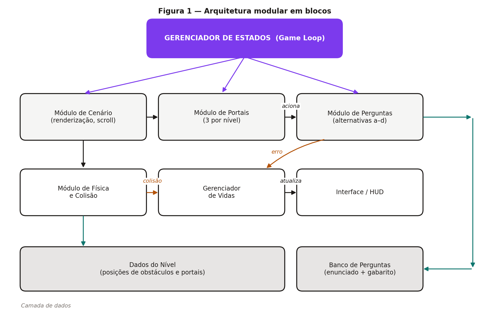
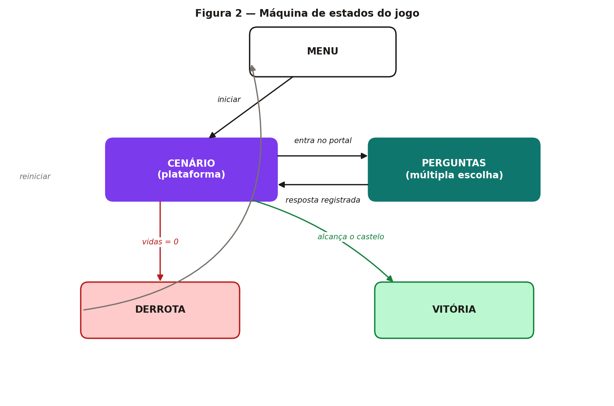
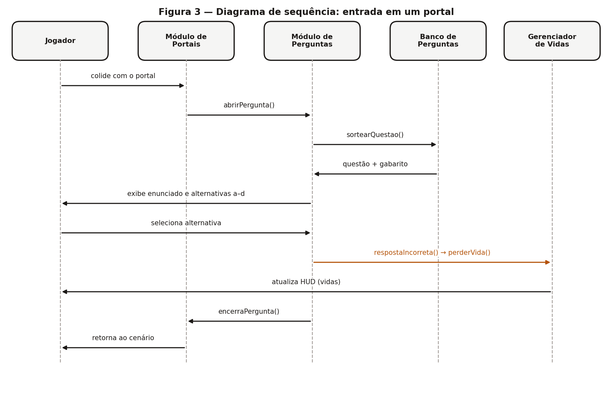

# 4. Arquitetura do Sistema

Esta seção descreve, de forma **textual** e **visual**, a arquitetura proposta para o jogo
**Fuga para o Castelo**, refinada a partir dos relatórios anteriores, com a justificativa
das decisões arquiteturais frente aos requisitos da Seção 3.

## 4.1 Visão Geral

A arquitetura combina dois padrões consagrados de desenvolvimento de jogos
(NYSTROM, *Game Programming Patterns*):

- **Game Loop** — um laço principal centraliza a atualização e a renderização a cada quadro.
- **State (máquina de estados)** — o jogo assume um estado por vez (menu, cenário,
  perguntas, vitória, derrota), e apenas o estado ativo é atualizado e desenhado.

Sobre esses padrões, o sistema é dividido em **três camadas**: uma camada de apresentação
e jogabilidade, uma camada de lógica de domínio e uma camada de dados. A Figura 1 apresenta
a organização em blocos.

*Figura 1 - Arquitetura modular em blocos*

## 4.2 Máquina de Estados

O **Gerenciador de Estados** é o componente central: ele decide qual estado está ativo e
executa as transições. A Figura 2 apresenta os estados e os eventos que provocam cada
transição.

*Figura 2 - Máquina de estados do jogo*

Observa-se que a verificação de derrota (vidas iguais a zero) ocorre sempre no estado
**CENÁRIO**: mesmo quando a vida é perdida por erro em uma pergunta, o jogo primeiro
retorna ao cenário e só então avalia a condição de término. Essa decisão centraliza a
regra **RN06** em um único ponto do código, evitando duplicação de lógica e atendendo ao
requisito de modularidade **RNF04**.

## 4.3 Módulos e Responsabilidades

| Módulo | Responsabilidade | Requisitos atendidos |
|--------|------------------|----------------------|
| **Gerenciador de Estados** | Controla o laço principal e a transição entre menu, cenário, perguntas, vitória e derrota. | RF06, RF12, RF13, RF14 |
| **Módulo de Cenário** | Renderiza o cenário lateral, o príncipe, os obstáculos, os portais e o castelo; controla o scroll. | RF01, RF03, RNF05 |
| **Módulo de Física e Colisão** | Trata movimentação, salto e detecção de colisão com obstáculos. | RF01, RF02, RF04, RF11 |
| **Módulo de Portais** | Detecta a entrada do príncipe em um portal e solicita a transição de estado. | RF05, RF06, RF12 |
| **Módulo de Perguntas** | Solicita uma questão ao banco, exibe enunciado e alternativas "a"–"d" e valida a resposta. | RF07, RF08, RF16, RNF07 |
| **Banco de Perguntas** | Armazena questões de conhecimentos gerais e seus gabaritos, em arquivo externo ao código. | RF14, RF16, RNF06 |
| **Gerenciador de Vidas** | Mantém a contagem de vidas, aplica penalidades e sinaliza a derrota. | RF09, RF10, RF11, RF14 |
| **Interface / HUD** | Exibe vidas restantes, feedback de acerto/erro e as telas de vitória e derrota. | RF15, RNF01, RNF05 |
| **Dados do Nível** | Descreve as posições de obstáculos, portais e do castelo, em arquivo externo ao código. | RF03, RF05, RNF06 |

## 4.4 Componentes Principais

### Personagem (Príncipe)
Entidade controlável com atributos de posição, velocidade, estado de salto e área de
colisão. É a única entidade que responde diretamente à entrada do jogador.

### Obstáculos (Pedras e Árvores)
Entidades estáticas com área de colisão. O contato aciona a penalidade de vida (RN05).
Pedras e árvores diferem apenas em sprite e dimensão da área de colisão, o que permite
tratá-las por uma mesma abstração.

### Portais
Três entidades por nível (RN02). O contato dispara a transição para o estado **PERGUNTAS**,
pausando a simulação do cenário. Um portal já utilizado é marcado como consumido, para que
não dispare a mesma pergunta duas vezes.

### Sistema de Perguntas
Recebe uma questão do banco, apresenta enunciado e quatro alternativas, captura a escolha
do jogador e devolve o veredito. Em caso de erro, notifica o Gerenciador de Vidas.

### Sistema de Vidas
Componente central de estado do jogador. Decrementa a contagem em caso de colisão ou
resposta incorreta e sinaliza a derrota ao chegar a zero.

## 4.5 Fluxo de Interação — Entrada em um Portal

A Figura 3 detalha, na forma de um diagrama de sequência simplificado, a interação entre os
componentes quando o jogador entra em um portal e responde **incorretamente** à questão —
o caminho mais crítico do sistema, por envolver todos os módulos de uma só vez.

*Figura 3 - Diagrama de sequência: entrada em um portal*

## 4.6 Justificativa das Decisões Arquiteturais

| Decisão | Justificativa |
|---------|---------------|
| Adoção do padrão **State** para os cinco estados do jogo | O jogo alterna entre dois contextos radicalmente diferentes (plataforma e perguntas). Separá-los em estados evita condicionais espalhadas pelo laço principal e atende diretamente a **RNF04** (modularidade). |
| **Separação entre Módulo de Portais e Módulo de Perguntas** | O portal é um elemento do cenário; a pergunta é conteúdo. Separá-los permite alterar a quantidade ou o posicionamento dos portais sem tocar na lógica das questões, e vice-versa. |
| **Banco de Perguntas em arquivo externo** (e não embutido no código) | Atende **RNF06**: novas questões são adicionadas editando um arquivo de dados, sem recompilação nem alteração de lógica. Também facilita a revisão do conteúdo por integrantes não responsáveis pelo código. |
| **Dados do Nível em arquivo externo** | Permite ajustar a dificuldade (posição e densidade de obstáculos) durante os testes sem alterar código, acelerando o ciclo de depuração descrito na Seção 5. |
| **Gerenciador de Vidas como componente único** | Colisão e resposta incorreta são causas diferentes com o mesmo efeito (RN04 e RN05). Centralizar a penalidade em um só componente garante consistência e um único ponto de verificação da derrota. |
| **Verificação de derrota apenas no estado CENÁRIO** | Simplifica a máquina de estados: o estado PERGUNTAS tem uma única saída, sempre de volta ao cenário. Reduz o número de transições e, com isso, o número de casos de teste. |
| **Renderização 2D com sprites simples** | Atende **RNF03** (portabilidade) e **RNF02** (desempenho), dispensando aceleração gráfica dedicada e permitindo execução em máquinas modestas. |

## 4.7 Tecnologias

A escolha definitiva de linguagem e biblioteca gráfica será consolidada na próxima etapa.
As candidatas em avaliação são bibliotecas voltadas ao desenvolvimento de jogos 2D com
suporte nativo a sprites, laço principal e captura de eventos de teclado, priorizando —
conforme **RNF02** e **RNF03** — baixo custo computacional e ausência de dependências de
difícil instalação.
